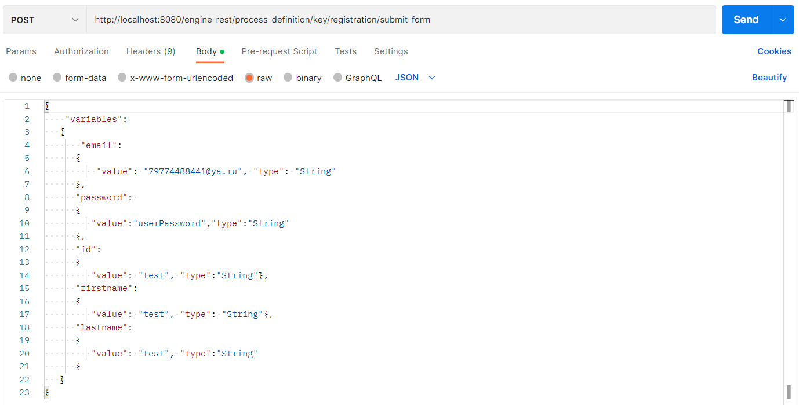
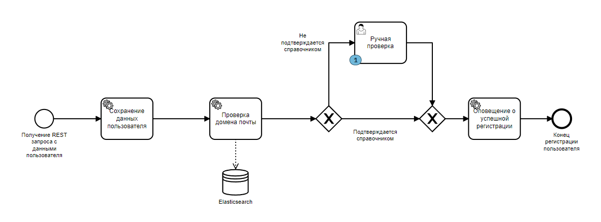
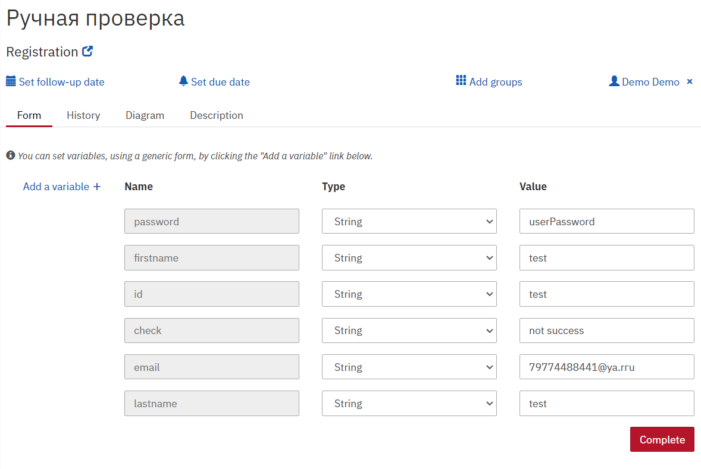

# Процесс регистрации

## Настройка и запуск

### 1.ElasticSearch
Выполнить команду или запустить ES port 9200

`docker run -d --name es762 -p 9200:9200 -e "discovery.type=single-node" elasticsearch:7.6.2`


### 2. Mail
Параметры почтового сервиса задаются в *переменных окружения* **конфигурации запуска**


   


### 2. Получение REST запроса с пользовательскими данными как триггер для старта процесса
   **REST-клиент** (*Postman*) выполняет ***POST*** запрос
   
    http://localhost:8080/engine-rest/process-definition/key/registration/submit-form

   Содержащий данные пользователя  

    Headers:
        Content-Type: application/json

    Body: (raw)
```json
{
    "variables":
   {
       "email":
      {
          "value": "79774488441@ya.ru", "type": "String"
      },
      "password": 
      {
         "value":"userPassword","type":"String"
      },
      "id":
      {
         "value": "test", "type":"String"},
      "firstname":
      {
         "value": "test", "type": "String"},
      "lastname":
      {
         "value": "test", "type":"String"
      }
   }
}
```




### 3. Camunda
**Username** и **Password** - *demo*
1) [Пользователи](http://localhost:8080/camunda/app/admin/default/#/users?searchQuery=%5B%5D), добавленные процессом


2) [Cockpit](http://localhost:8080/camunda/app/cockpit/default/#/process-definition/registration:1:e12fa2eb-e172-11ed-b851-00ff49ad950e/runtime?searchQuery=%5B%5D&viewbox=%7B%22Definitions_0fr9mxs%22:%7B%22x%22:33.96564417177914,%22y%22:-74.36564417177914,%22width%22:1469.9386503067485,%22height%22:642.9447852760736%7D%7D&detailsTab=job-definition-table) схема процесса



3) [UserTask](http://localhost:8080/camunda/app/tasklist/default/#/?searchQuery=%5B%5D&filter=28bdc1e9-e00b-11ed-abb9-0ed5293e5541&sorting=%5B%7B%22sortBy%22:%22created%22,%22sortOrder%22:%22desc%22%7D%5D&task=63340087-e17c-11ed-9e46-00ff49ad950e) подтверждение регистрации пользователя проверяющим
