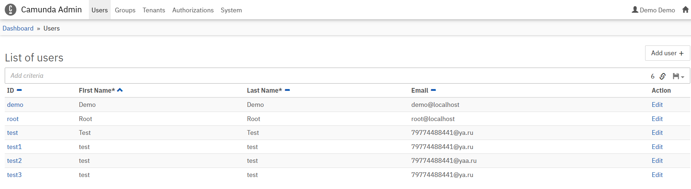

1. ElasticSearch
   
docker run -d --name es762 -p 9200:9200 -e "discovery.type=single-node" elasticsearch:7.6.2

   
2. Получение REST запроса с пользовательскими данными как триггер для старта процесса
    
    REST API клиент, например Postman, выполняет POST-запрос
   
    http://localhost:8080/engine-rest/process-definition/key/registration/submit-form

   Содержащий данные о пользователе - почту и пароль    

    Headers:
        Content-Type: application/json

    Body:
       (raw)
   {
   "variables": {
   "email":{"value":"userEmail","type":"String"},
   "password":{"value":"userPassword","type":"String"}
   }
   }

